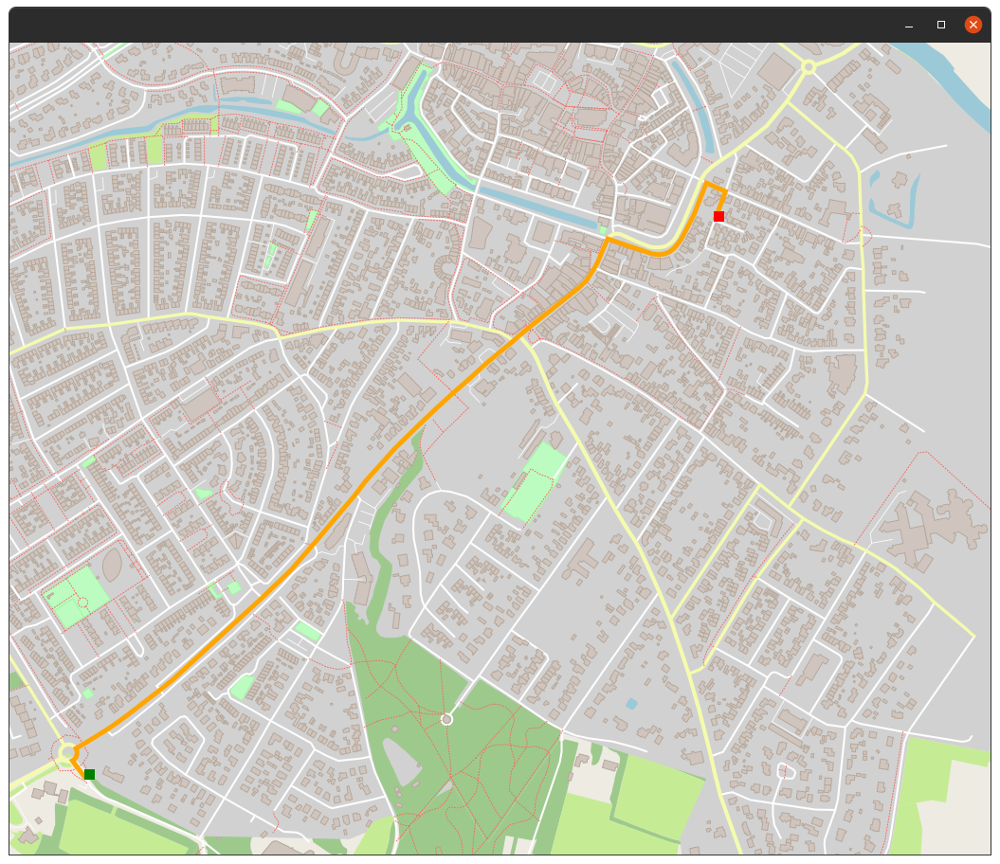

# Route Planning Project

This repo contains my submission (**a work in progress so far!**) of the Route Planning Project.

The Route Planning project is part of the Udacity C++ Nanodegree [click here for more info](https://www.udacity.com/course/c-plus-plus-nanodegree--nd213)

## Origin

Note that I started this repository by creating a fork from the starter code that can be found [here](https://github.com/udacity/CppND-Route-Planning-Project)

I strongly recommend anyone interested in doing the same project to start with the original starter code and follow Udacities resources. Only when you are specifically interested in how I did on the project, you're welcome to proceed in this repo :-).

